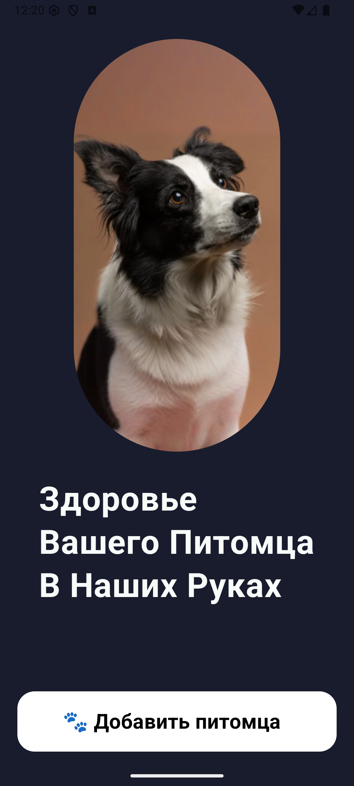
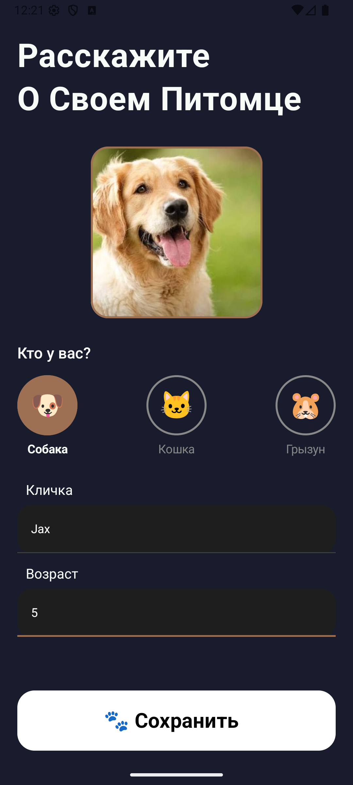
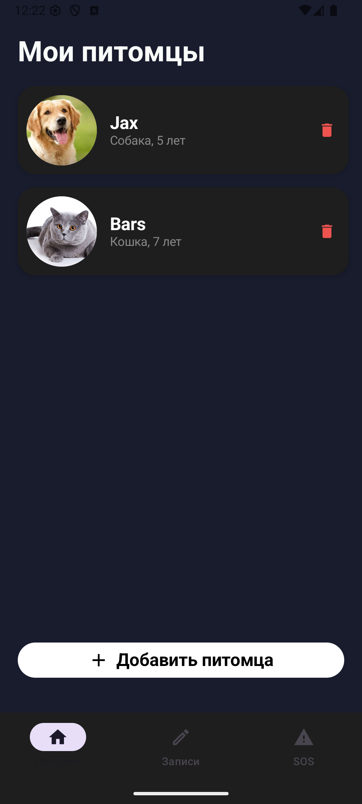
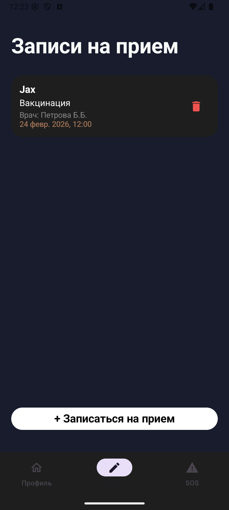
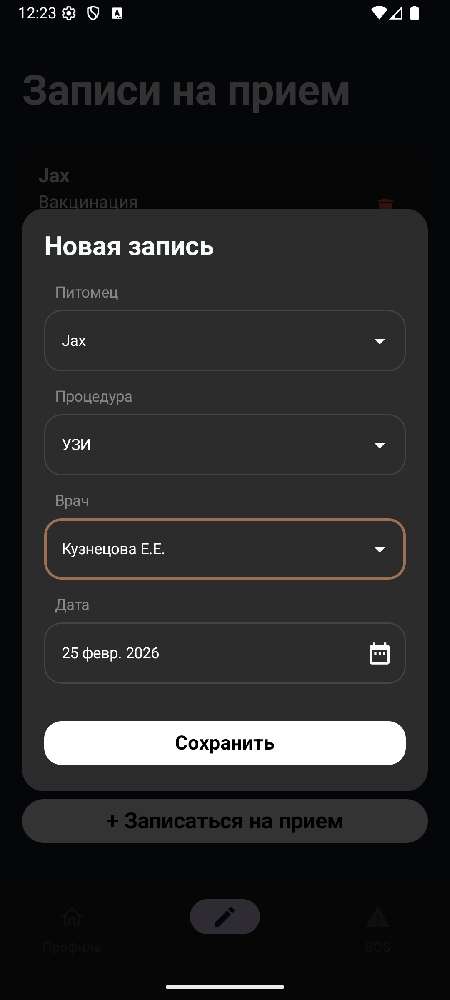
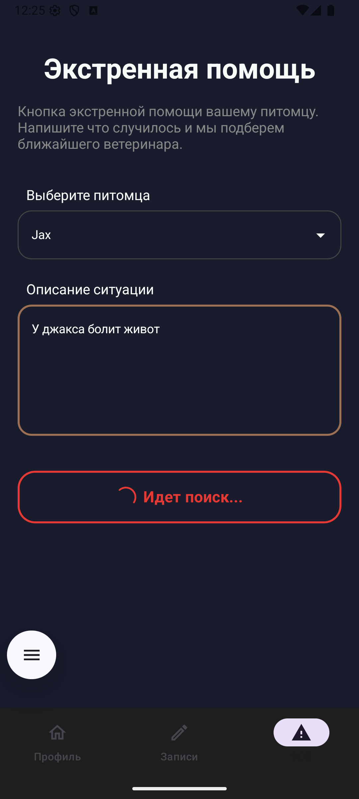

# VetClinic: Ветеринарная Клиника (Android App)

**Описание проекта**  
Приложение «Ветеринарная Клиника» разработано на языке **Kotlin** для платформы **Android**. Помогает владельцам домашних животных управлять картами питомцев, планировать визиты к ветеринару и вызывать экстренную помощь.  

Проект полностью выполнен на современном стеке: **Jetpack Compose** для UI и **Room Database** для локального хранения данных.

## Возможности

-  **Новый пациент (Карточка питомца)**  
  Добавление питомца с фото, именем, возрастом и типом  
  Просмотр списка питомцев  
  Редактирование и удаление  

-  **Запись к врачу**  
  Создание записи на дату/время  
  Выбор врача, процедуры и питомца  
  Список всех визитов (прошедших и предстоящих)  

-  **Медицинские карточки**  
  История через записи (Appointments) — привязка к питомцу  

-  **Экстренная помощь (SOS)**  
  Быстрый поиск ближайшего ветеринара  

## Схема Базы Данных (Room)

### Таблица `pets` (Пациенты)
| Поле | Тип | Описание | Ключ |
|------|-----|----------|------|
| `id` | `Int` | Уникальный ID | Primary Key |
| `name` | `String` | Кличка | |
| `selectedType` | `String` | Тип (dog/cat/rodent) | |
| `age` | `Int` | Возраст | |
| `photoLocation` | `String?` | Путь к фото | Nullable |

### Таблица `appointments` (Записи)
| Поле | Тип | Описание | Ключ |
|------|-----|----------|------|
| `id` | `Int` | Уникальный ID | Primary Key |
| `petId` | `Int` | Ссылка на питомца | Foreign Key |
| `doctor` | `String` | Имя врача | |
| `procedure` | `String` | Процедура | |
| `date` | `Long` | Дата/время (Unix) | |

**Связь:** Один-ко-Многим (Pet → Appointments)

## Архитектура (Clean Architecture + MVVM)

Entity → DAO → ViewModel → UI (Compose)
↓
Room Database

## Технологический стек

- **Язык:** Kotlin  
- **UI:** Jetpack Compose  
- **База данных:** Room Database  
- **Асинхронность:** Coroutines + Flow  
- **Навигация:** Navigation Compose  
- **Изображения:** Coil  
- **Архитектура:** MVVM + Clean Architecture  

## Скриншоты

| Стартовый экран | Добавление питомца | Список питомцев |
|---|---|---|
|  |  |  |

| Список записей | Создание записи | Экстренная помощь |
|---|---|---|
|  |  |  |

## Установка и запуск

**Требования:** Android Studio **Hedgehog | Iguana** или новее

1. Клонируйте репозиторий
2. Откройте проект в Android Studio  
3. Дождитесь **Gradle Sync**
4. Запустите на эмуляторе (**API 24+**) или устройстве

**Или:** Установите APK из раздела **Releases**

